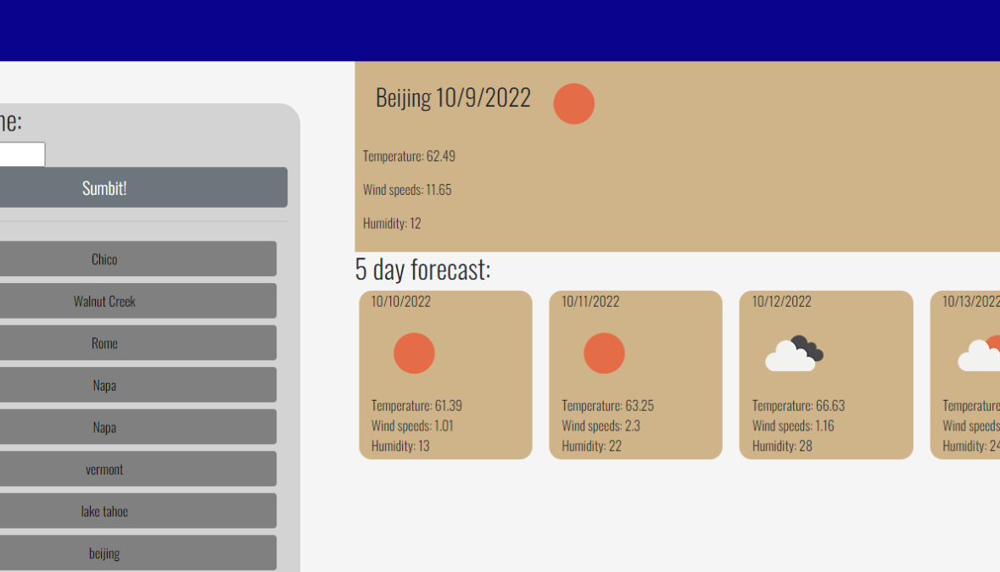

# Your Weather Tracker:

## Description

Here we have a wonderful, wonderful weather app. This app delivers weather data to the user for a selected city. [Here is a link to the application](https://thedomconrad.github.io/weather-reader1/)
A user may view todays weather along with a 5 day forecast.

## How to use

Simply enter the name of the city and click "submit". The current weather along with a 5 day forecast will be displayed! You may keep entering cities and a list of clickable buttons will aggregate on the left. You may revisit selected cities' weather at any time and if you refresh the page your list will persist! Enjoy :)

## Screenshot of app



## the Code!
Here I am showcasing the loop that populates our weather data across the page! Pretty simple and effictive.

```
            fetch(citiLoco).then(function (targetWeather) {
                return targetWeather.json()
            }).then(function (weatherData) {
                $("#today").show(); //we are showing the weather pages after the data has been retrieved
                $("#main-row").show();
                $("#today-city-date").text(weatherData.city.name + " " + moment().format("M/D/Y")) //using weather data and moment JS to show the city and time
                $("#today-icon").attr("src", "https://openweathermap.org/img/wn/" + weatherData.list[0].weather[0].icon + "@2x.png") //this populates the icon
                $("#today").children().eq(1).text("Temperature: " + weatherData.list[0].main.temp)
                $("#today").children().eq(2).text("Wind speeds: " + weatherData.list[0].wind.speed)
                $("#today").children().eq(3).text("Humidity: " + weatherData.list[0].main.humidity)
                for (x = 1; x < 6; x++) { //x had to be 1 here because we are going to multiply in this loop. we cant multiply by 0
                    $("#" + x).children().eq(0).text(moment().add(x, "d").format("M/D/Y")) //using a for loop with some simple math and dom navigation to populate all cards with relevant data
                    $("#" + x).children().eq(1).attr("src", "https://openweathermap.org/img/wn/" + weatherData.list[8 * x - 1].weather[0].icon + "@2x.png")
                    $("#" + x).children().eq(2).text("Temperature: " + weatherData.list[8 * x - 1].main.temp) //8 times X because every 8th item in the index of weather data is the next day, minus 1 to get the daytime
                    $("#" + x).children().eq(3).text("Wind speeds: " + weatherData.list[8 * x - 1].wind.speed) 
                    $("#" + x).children().eq(4).text("Humidity: " + weatherData.list[8 * x - 1].main.humidity)
                }
            })
        })
```

## Author Links
---[Linkedin](https://www.linkedin.com/in/dominic-conradson-76638b172/)---
[GitHub](https://github.com/theDomConrad/)---
[Portfolio](https://thedomconrad.github.io/Dominic-Conradson-Portfolio/)---